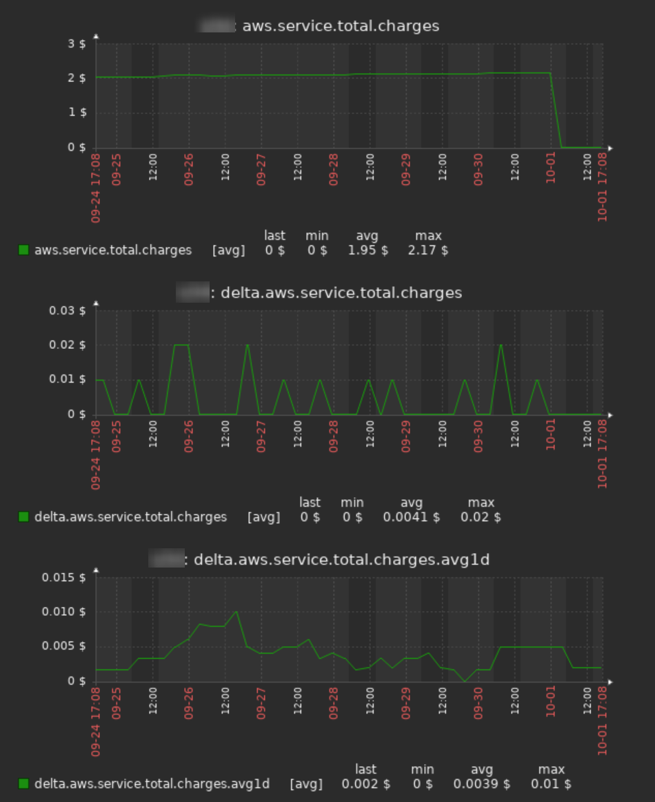

# zbx_aws_billing

[![Contributors][contributors-shield]][contributors-url]
[![Forks][forks-shield]][forks-url]
[![Stargazers][stars-shield]][stars-url]
[![Issues][issues-shield]][issues-url]
[![MIT License][license-shield]][license-url]

Zabbix template and scripts for AWS billing monitoring

## Requirements
- Installed jq, awscli packages
- Probably you need to increase ZBX timeout due to much time to receive the AWS reply 

## Installation
- Put /etc/zabbix/ scripts and ZBX config to the appropriate place
- Restart zabbix-agent
- Set up aws credentials with the appropriate rights with AWSBillingReadOnlyAccess, CloudWatchLogsReadOnlyAccess policies for scripts - run aws configure under zabbix user.
- check with the following command: `zabbix_agentd -t aws.services`
- Import zbx_aws_billing_export_templates.xml to ZBX server and assign it to the host  
- Wait at least some days and tune zabbix Macro for the template/host accordingly your levels.
- Do not change zabbix interval for items - Actually it updates once in a 4 hours.

## Features
- There is no zero-counted (not used) AWS services. 
- Use host screen

## Tested
It have been tested on CentOS 7.

## Figures
 
 
 
 

<!-- MARKDOWN LINKS & IMAGES -->
<!-- https://www.markdownguide.org/basic-syntax/#reference-style-links -->
[contributors-shield]: https://img.shields.io/github/contributors/skindud/zabbix-telegram-notification.svg?style=for-the-badge
[contributors-url]: https://github.com/skindud/zabbix-telegram-notification/graphs/contributors
[forks-shield]: https://img.shields.io/github/forks/skindud/zabbix-telegram-notification.svg?style=for-the-badge
[forks-url]: https://github.com/skindud/zabbix-telegram-notification/network/members
[stars-shield]: https://img.shields.io/github/stars/skindud/zabbix-telegram-notification.svg?style=for-the-badge
[stars-url]: https://github.com/skindud/zabbix-telegram-notification/stargazers
[issues-shield]: https://img.shields.io/github/issues/skindud/zabbix-telegram-notification.svg?style=for-the-badge
[issues-url]: https://github.com/skindud/zabbix-telegram-notification/issues
[license-shield]: https://img.shields.io/github/license/skindud/zabbix-telegram-notification.svg?style=for-the-badge
[license-url]: https://github.com/skindud/zabbix-telegram-notification/blob/master/LICENSE.txt
